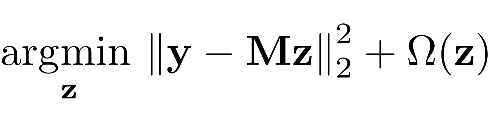
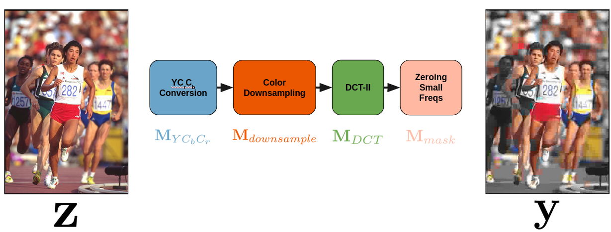
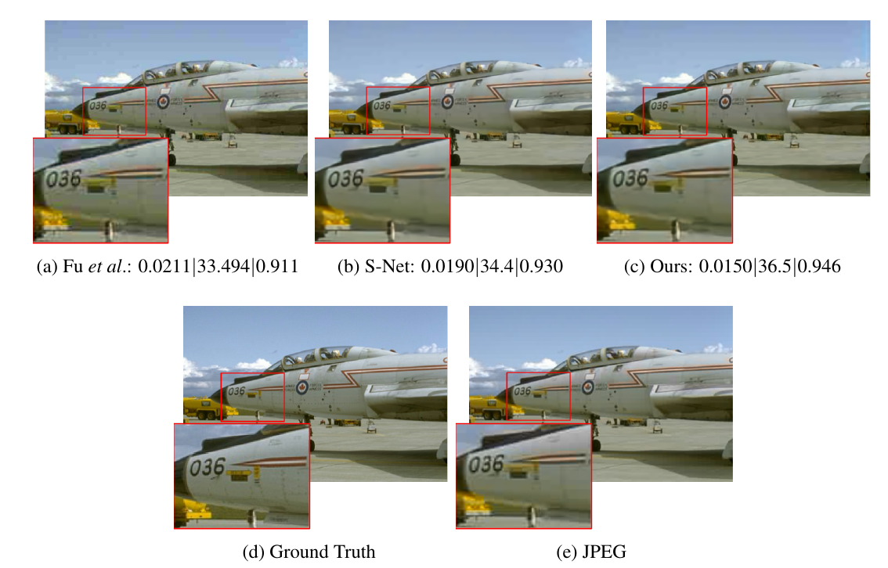

# When to Use CNNs for Inverse Problems
This repository contains a summary and in the future code for the methods described in "When to use Convolutional Neural Networks for Inverse Problems" which appeared in the CVPR 2020 procedings.

Paper: https://arxiv.org/abs/2003.13820

## Abstract
Reconstruction tasks in computer vision aim fundamentally to recover an undetermined signal from a set of noisy measurements. Examples include super-resolution, image denoising, and non-rigid structure from motion, all of which have seen recent advancements through deep learning. However, earlier work made extensive use of sparse signal reconstruction frameworks (e.g convolutional sparse coding). While this work was ultimately surpassed by deep learning, it rested on a much more developed theoretical framework. Recent work by Papyan et. al provides a bridge between the two approaches by showing how a convolutional neural network (CNN) can be viewed as an approximate solution to a convolutional sparse coding (CSC) problem. In this work we argue that for some types of inverse problems the CNN approximation breaks down leading to poor performance. We argue that for these types of problems the CSC approach should be used instead and validate this argument with empirical evidence. Specifically we identify JPEG artifact reduction and non-rigid trajectory reconstruction as challenging inverse problems for CNNs and demonstrate state of the art performance on them using a CSC method. Furthermore, we offer some practical improvements to this model and its application, and also show how insights from the CSC model can be used to make CNNs effective in tasks where their naive application fails.

## Summary

We are concerned with solving inverse problems where we seek to recover some original signal from a degraded set of linear measurements. This sort problem can be written in the form:

where **y** is the input signal which has been degraded by some known operator **M**. A naive deep learning approach to this problem would take a set of ground truth (**y**, **z**) pairs and directly learn the mapping. A different but related approach is to learn a hierarchical sparsity prior, introduced in [Convolutional Neural Networks Analyzed via Convolutional Sparse Coding](https://arxiv.org/abs/1607.08194) which explains the relationship between the two ideas. In previous work we have introduced a framework for applying this prior to real world problem by expressing the optimization as a differentiable network which can then be optimized through stochastic gradient descent. In this work we improve this method and show that the structure of the **M** matrix has a large effect on the efficacy of the CNN approach as compared with the convoultional sparse coding (CSC) approach. Please refer to the paper for the full details of this effort but the main finding is that when **M** is close to a diagonal structure, then the CNN approach dominates, but when **M** is of a more general structure the CSC approach is supperior. We validate this on a two real world tasks: JPEG artifact removal and trajectory reconstruction. Examples of these can be found below.

## JPEG ARTIFACT REDUCTION

The JPEG compression algorithm can introduce blocking artifacts when using a very low quality factor. These artifacts are fundamentally related to the compression, but just as with blurred or noisy images it should be possible to estimate the original uncompresssed image based on the statistics of natural images. In order to apply our method we need to approximate the compression algorithm with a linear operator like so:

We can then train our model just like a standard neural network to remove these artifacts. The following figure contains our results compared with the best deep learning based approaches.

